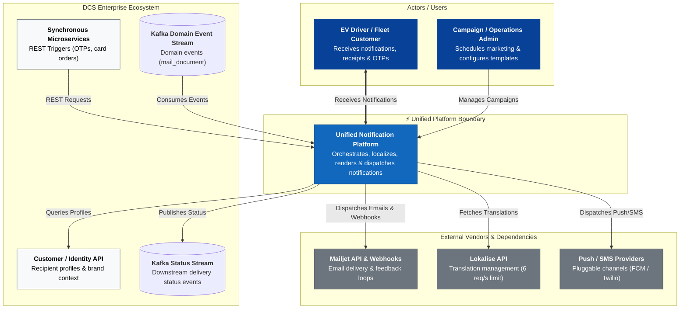

# unified-notification-platform

```mermaid
flowchart TB
  %% C4 Level 1: System Context Diagram (GitHub Native)

  subgraph Users ["Actors / Users"]
    driver["<b>EV Driver / Fleet Customer</b><br/>Receives notifications, receipts & OTPs"]
    operator["<b>Campaign / Operations Admin</b><br/>Schedules marketing & configures templates"]
  end

  subgraph SystemBoundary ["⚡ Unified Platform Boundary"]
    notificationSystem["<b>Unified Notification Platform</b><br/>Orchestrates, localizes, renders & dispatches notifications"]
  end

  subgraph Internal ["DCS Enterprise Ecosystem"]
    apiProducers["<b>Synchronous Microservices</b><br/>REST Triggers (OTPs, card orders)"]
    kafkaEvents[("<b>Kafka Domain Event Stream</b><br/>Domain events (mail_document)")]
    customerApi["<b>Customer / Identity API</b><br/>Recipient profiles & brand context"]
    kafkaStatus[("<b>Kafka Status Stream</b><br/>Downstream delivery status events")]
  end

  subgraph External ["External Vendors & Dependencies"]
    mailjet["<b>Mailjet API & Webhooks</b><br/>Email delivery & feedback loops"]
    lokalise["<b>Lokalise API</b><br/>Translation management (6 req/s limit)"]
    pushSms["<b>Push / SMS Providers</b><br/>Pluggable channels (FCM / Twilio)"]
  end

  driver <==>|"Receives Notifications"| notificationSystem
  operator -->|"Manages Campaigns"| notificationSystem

  apiProducers -->|"REST Requests"| notificationSystem
  kafkaEvents -->|"Consumes Events"| notificationSystem

  notificationSystem -->|"Queries Profiles"| customerApi
  notificationSystem -->|"Fetches Translations"| lokalise
  notificationSystem -->|"Dispatches Emails & Webhooks"| mailjet
  notificationSystem -->|"Dispatches Push/SMS"| pushSms

  notificationSystem -->|"Publishes Status"| kafkaStatus

  %% Styling for C4 visual look
  classDef userStyle fill:#084298,stroke:#084298,color:#fff;
  classDef systemStyle fill:#1168bd,stroke:#0b4884,color:#fff;
  classDef internalStyle fill:#f8f9fa,stroke:#6c757d,color:#000;
  classDef externalStyle fill:#6c757d,stroke:#495057,color:#fff;

  class driver,operator userStyle;
  class notificationSystem systemStyle;
  class apiProducers,customerApi internalStyle;
  class mailjet,lokalise,pushSms externalStyle;
```
